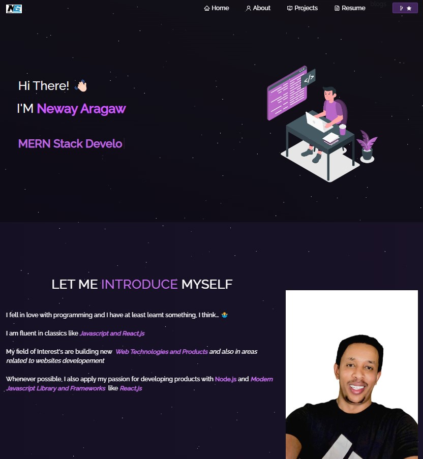

<h2 className="text-center">
  Portfolio Website - v2.0 
  <a href="https://portfolio-react-woad-eight-18.vercel.app/" target="_blank" rel="noopener noreferrer">newayaragaw.tech</a>
</h2>

  

 

  
  
  
  
  

<h3 className="text-center">
  <a href="https://github.com/neway-aragaw/Portfolio/issues" target="_blank" rel="noopener noreferrer">
    <i className="fas fa-bug"></i> Report Bug
  </a>
  &nbsp; &nbsp;
  <a href="https://github.com/neway-aragaw/Portfolio/issues" target="_blank" rel="
